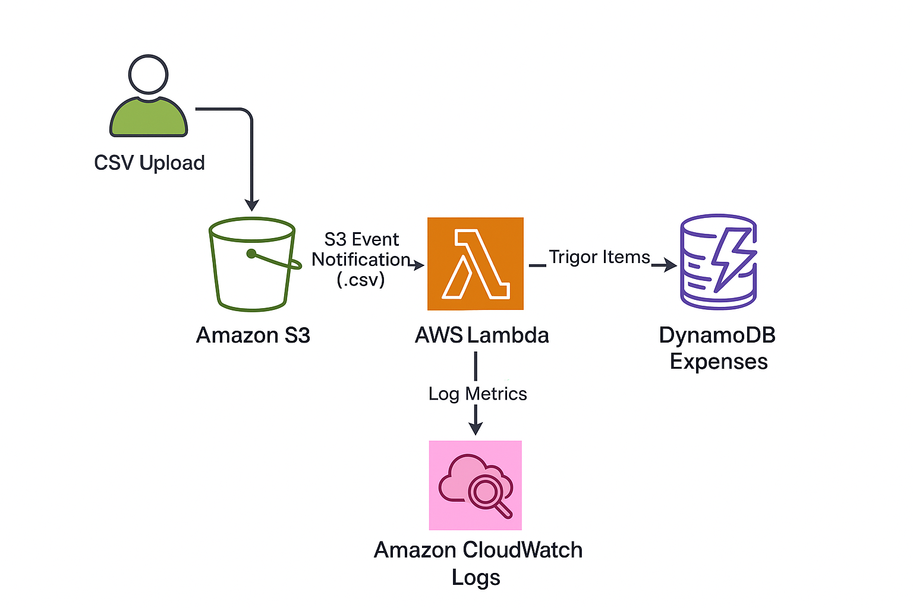

# AWS Serverless Expense Tracker

An AWS serverless pipeline for tracking expenses from CSV uploads.  
Integrates **Amazon S3**, **AWS Lambda**, **Amazon DynamoDB**, and **Amazon CloudWatch** for processing and monitoring expense data.

---
## Architecture


---

## Features
- **CSV upload via S3** – Upload a CSV to the bucket, and it automatically triggers processing.
- **Serverless architecture** – No servers to manage or maintain.
- **AWS Lambda** – Parses CSV files and inserts them into DynamoDB.
- **Amazon DynamoDB** – Scalable NoSQL database for expense records.
- **Amazon CloudWatch** – Real-time monitoring and debugging via logs.
- **Free Tier friendly** – Uses AWS services that fit into the Free Tier.

---

## How It Works
1. Upload CSV to your S3 bucket.
2. S3 Event Trigger invokes the Lambda function.
3. Lambda Function parses the CSV and writes to DynamoDB.
4. CloudWatch Logs store processing details.

## AWS Resources Used
- **S3 Bucket**: `nuttz-finance-tracker-bucket`  
- **DynamoDB Table**: `Expenses`  
- **Lambda Function**: `process-expenses`  
- **Trigger**: S3 `ObjectCreated:Put` → Lambda  
- **Region**: `ap-southeast-2` (Sydney)

---

## Project Structure
```text
.
├── lambda_function.py         # AWS Lambda function code
├── architecture.png           # AWS architecture diagram
├── sample-expenses.csv        # Example CSV file for testing
└── README.md
